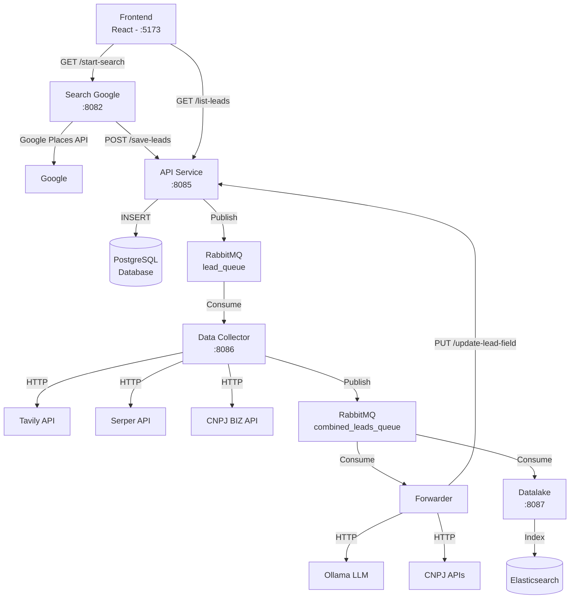

# Sistema de Busca e Enriquecimento de Leads - Documentação de Fluxo

## Visão Geral

O sistema é uma aplicação de microserviços para busca, coleta, enriquecimento e armazenamento de leads empresariais. Utiliza arquitetura orientada a eventos com RabbitMQ para comunicação assíncrona entre serviços.

## Arquitetura de Microserviços

### 1. Frontend (React/TypeScript) - Porta 5173
**Função**: Interface de usuário para busca e visualização de leads

**Componentes principais**:
- `SearchLeads.tsx`: Formulário de busca com parâmetros (categoria, CEP, raio, país)
- `LeadList.tsx`: Listagem e visualização de leads salvos

**Comunicação**:
- → `search-google` (GET /start-search): Inicia busca de leads
- → `api` (GET /list-leads): Lista leads salvos

---

### 2. Search Google Service - Porta 8082
**Função**: Integração com Google Places API para busca inicial de estabelecimentos

**Endpoints**:
- GET `/start-search`: Inicia busca com parâmetros
- GET `/health`: Status do serviço

**Processo**:
1. Recebe parâmetros de busca (categoria, CEP, raio, max_results, país)
2. Geocodifica CEP para obter coordenadas
3. Busca lugares via Google Places API
4. Obtém detalhes de cada lugar encontrado
5. Envia leads para API service

**Comunicação**:
- ← Frontend: Recebe requisições de busca
- → API Service: POST /save-leads com dados dos leads

---

### 3. API Service - Porta 8085
**Função**: Gerenciamento central de leads, persistência em PostgreSQL e orquestração do fluxo

**Endpoints**:
- POST `/save-leads`: Salva novos leads no banco
- PUT `/update-lead-field`: Atualiza campos específicos de um lead
- GET `/health`: Status do serviço

**Responsabilidades**:
- Persistência de leads no PostgreSQL
- Publicação de leads na fila RabbitMQ para enriquecimento
- Atualização de dados enriquecidos
- CORS habilitado para comunicação com frontend

**Banco de Dados (PostgreSQL)**:
- Tabela `leads` com campos:
  - Identificação: ID, GoogleId, BusinessName, RegisteredName
  - Localização: Address, City, State, ZIPCode, Country
  - Contato: Phone, Email, Website, Owner
  - Redes Sociais: Facebook, Instagram, TikTok, WhatsApp
  - Negócio: Category, Description, Rating, BusinessStatus
  - Dados Empresariais: CNPJ, PrimaryActivity, SecondaryActivities, EquityCapital, FoundationDate

**Comunicação**:
- ← Search Google: Recebe leads para salvar
- → RabbitMQ (`lead_queue`): Publica leads para enriquecimento
- ← Forwarder: Recebe atualizações de campos via HTTP

---

### 4. Data Collector Service - Porta 8086
**Função**: Enriquecimento de dados usando APIs externas

**APIs Integradas**:
1. **Tavily API**: Busca informações na web sobre a empresa
2. **Serper API**: Busca CNPJ e informações adicionais via Google Search
3. **CNPJ BIZ API**: Dados oficiais de empresas brasileiras

**Processo**:
1. Consome leads da fila `lead_queue`
2. Para cada lead:
   - Busca dados via Tavily (max 5 resultados)
   - Busca CNPJ via Serper (max 10 resultados)
   - Busca dados empresariais via CNPJ BIZ
3. Combina todos os dados em `CombinedLeadData`
4. Publica na fila `combined_leads_queue`

**Estrutura de Dados Combinados**:
```json
{
  "lead": {...},
  "tavily_data": {...},
  "tavily_extra": {
    "cnpj": "",
    "phone": "",
    "owner": "",
    "email": "",
    "website": ""
  },
  "serper_data": {...},
  "cnpj_data": {...}
}
```

**Comunicação**:
- ← RabbitMQ (`lead_queue`): Consome leads para enriquecer
- → APIs Externas: Requisições HTTP
- → RabbitMQ (`combined_leads_queue`): Publica dados enriquecidos

---

### 5. Forwarder Service
**Função**: Análise inteligente e extração de informações usando LLM (Ollama)

**Processo em 2 Etapas**:

**Etapa 1 - Extração Básica**:
- Envia dados combinados para Ollama com prompt estruturado
- Extrai: RegisteredName, CNPJ, Contatos, DataFundacao, Website, RedesSociais
- Atualiza campos no banco via API service

**Etapa 2 - Enriquecimento Adicional**:
- Se CNPJ foi encontrado:
  - Busca detalhes via CNPJ BIZ API
  - Busca dados via Invertexto API
- Envia dados enriquecidos para segunda análise Ollama
- Extrai: Email, PrimaryActivity, SecondaryActivities, EquityCapital
- Atualiza campos adicionais no banco

**Integração com Ollama**:
- URL configurável (OLHAMA_URL)
- Usa modelo LLM para análise semântica
- Prompts estruturados para extração JSON

**Comunicação**:
- ← RabbitMQ (`combined_leads_queue`): Consome dados combinados
- → Ollama API: Análise via LLM
- → APIs Externas: CNPJ BIZ, Invertexto
- → API Service: PUT /update-lead-field para atualizar campos

---

### 6. Datalake Service - Porta 8087
**Função**: Armazenamento de dados completos em Elasticsearch para análise

**Processo**:
1. Consome mensagens da fila `combined_leads_queue`
2. Indexa documentos no Elasticsearch (índice: `combined_leads`)
3. Mantém histórico completo de dados enriquecidos

**Elasticsearch**:
- Índice: `combined_leads`
- Armazena estrutura completa de `CombinedLeadData`
- Permite buscas e análises avançadas

**Comunicação**:
- ← RabbitMQ (`combined_leads_queue`): Consome dados para indexação
- → Elasticsearch: Indexação de documentos

---

## Fluxo de Dados Completo



## Sequência Detalhada do Processo

1. **Início da Busca**
   - Usuário define parâmetros no frontend
   - Frontend envia requisição para Search Google

2. **Coleta Inicial**
   - Search Google geocodifica CEP
   - Busca lugares no Google Places
   - Obtém detalhes de cada lugar
   - Envia para API Service

3. **Persistência e Distribuição**
   - API Service salva lead no PostgreSQL
   - Publica lead na fila RabbitMQ

4. **Enriquecimento de Dados**
   - Data Collector consome lead da fila
   - Busca informações em 3 APIs externas
   - Combina todos os dados
   - Publica dados combinados em nova fila

5. **Análise Inteligente**
   - Forwarder consome dados combinados
   - Primeira análise com Ollama (extração básica)
   - Atualiza campos no banco
   - Se CNPJ encontrado, busca mais dados
   - Segunda análise com Ollama (dados adicionais)
   - Atualiza campos finais no banco

6. **Armazenamento para Análise**
   - Datalake consome dados combinados
   - Indexa no Elasticsearch
   - Mantém histórico completo

## Tecnologias Utilizadas

### Backend
- **Go**: Todos os microserviços backend
- **PostgreSQL**: Banco de dados relacional principal
- **RabbitMQ**: Message broker para comunicação assíncrona
- **Elasticsearch**: Armazenamento e busca de dados não estruturados
- **Docker/Docker Compose**: Orquestração de containers

### Frontend
- **React 19**: Framework UI
- **TypeScript**: Type safety
- **Vite**: Build tool
- **Tailwind CSS v4**: Estilização

### APIs Externas
- **Google Places API**: Busca de estabelecimentos
- **Tavily API**: Busca web inteligente
- **Serper API**: Google Search programático
- **CNPJ BIZ API**: Dados empresariais brasileiros
- **Invertexto API**: Dados adicionais de CNPJ
- **Ollama**: LLM local para análise de texto

## Configuração de Ambiente

### Variáveis de Ambiente Principais
- `PORT`: Porta de cada serviço
- `RABBITMQ_URL`: URL de conexão RabbitMQ
- `DB_*`: Configurações PostgreSQL
- `ELASTICSEARCH_URL`: URL do Elasticsearch
- `GOOGLE_PLACES_API_KEY`: Chave API Google
- `OLHAMA_URL`: Endpoint do Ollama LLM

## Filas RabbitMQ

1. **lead_queue**
   - Produtor: API Service
   - Consumidor: Data Collector
   - Payload: Lead básico do banco

2. **combined_leads_queue**
   - Produtor: Data Collector
   - Consumidores: Forwarder, Datalake
   - Payload: Lead + dados enriquecidos de todas APIs

## Endpoints HTTP Principais

### Search Google (:8082)
- `GET /start-search?category_id=X&zipcode_id=Y&radius=Z&max_results=N&country=C`
- `GET /health`

### API Service (:8085)
- `POST /save-leads` - Body: array de leads
- `PUT /update-lead-field` - Body: {id, field, value}
- `GET /health`

## Monitoramento e Saúde

Todos os serviços possuem:
- Endpoint `/health` para verificação de status
- Logs detalhados de operações
- Healthchecks configurados no Docker Compose
- Tratamento de erros e retry logic para mensagens RabbitMQ

## Escalabilidade

O sistema foi projetado para escalar horizontalmente:
- Serviços stateless podem ter múltiplas instâncias
- RabbitMQ distribui mensagens entre consumidores
- PostgreSQL e Elasticsearch podem ser clusterizados
- Separação clara de responsabilidades permite evolução independente

## Segurança

- CORS configurado para comunicação frontend-backend
- Credenciais em variáveis de ambiente
- Comunicação interna via rede Docker isolada
- Validação de dados em cada serviço